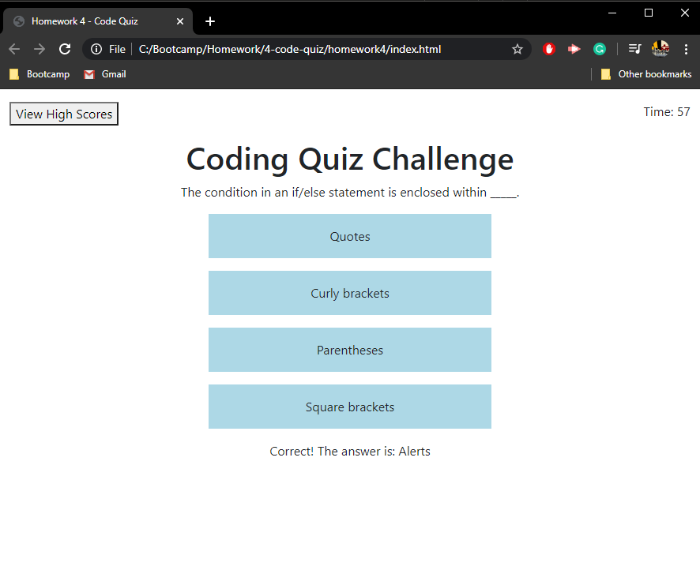

# Code Quiz

This is the code quiz we had to create for homework #4.

Deployed app: https://tmylesc.github.io/homework4/

It involves generating questions and multiple choice answers while a timer counts down. Then, it saves the score in local storage to build a high score list.

